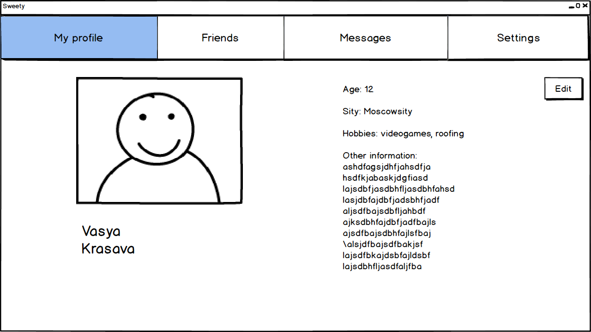

# Требования к проекту
---

# Содержание
1 [Введение](#intro)  
1.1 [Назначение](#appointment)  
1.2 [Бизнес-требования](#business_requirements)  
1.2.1 [Исходные данные](#initial_data)  
1.2.2 [Возможности бизнеса](#business_opportunities)  
1.2.3 [Границы проекта](#project_boundary)  
1.3 [Аналоги](#analogues)  
2 [Требования пользователя](#user_requirements)  
2.1 [Программные интерфейсы](#software_interfaces)  
2.2 [Интерфейс пользователя](#user_interface)  
2.3 [Характеристики пользователей](#user_specifications)  
2.3.1 [Классы пользователей](#user_classes)  
2.3.2 [Аудитория приложения](#application_audience)  
2.3.2.1 [Целевая аудитория](#target_audience)   
2.4 [Предположения и зависимости](#assumptions_and_dependencies)  
3 [Системные требования](#system_requirements)  
3.1 [Функциональные требования](#functional_requirements)  
3.1.1 [Основные функции](#main_functions)  
3.1.1.1 [Вход пользователя в свой акаунт](#login_to_acaunt)  
3.1.1.2 [Регистрация нового пользователя](#add_new_user)   
3.1.1.3 [Добавление новой заметки](#add_new_note)  
3.1.1.4 [Просмотр заметок](#veiw_all_notes)  
3.1.1.5 [Редактирование старой заметки](#edit_old_note)  
3.1.1.6 [Поиск заметки по имени](#find_note_by_name)   
3.1.1.7 [Удаление заметки](#delete_note)   
3.1.1.8 [Выход из акаунта](#logout_from_acaunt)   
3.1.2 [Ограничения и исключения](#restrictions_and_exclusions)    
3.2 [Нефункциональные требования](#non-functional_requirements)  
3.2.1 [Атрибуты качества](#quality_attributes)  
3.2.1.1 [Требования к удобству использования](#requirements_for_ease_of_use)  
3.2.1.2 [Требования к безопасности](#security_requirements)  
3.2.2 [Внешние интерфейсы](#external_interfaces)   

<a name="intro"/>

# 1 Введение

<a name="appointment"/>

## 1.1 Назначение
В этом документе описаны функциональные и нефункциональные требования к мессенджеру Sweety, реализующего возможность передачи сообщений, файлов и изображений. Этот документ предназначен для команды, которая будет реализовывать и проверять корректность работы приложения. 

<a name="business_requirements"/>

## 1.2 Бизнес-требования

<a name="initial_data"/>

### 1.2.1 Исходные данные
Каждый день люди сталкиваются с необходимостью связаться с другими людьми: передать информацию любого рода или просто узнать как у них дела. И в современном мире для этих целей придумано огромное количество способов, но наибольшей популярностью в последние годы пользуются текстовые мессенджеры. Такие приложения действительно очень удобны, если вашей целью является простое общение, обсуждение чего-либо с друзьями или родсвтенниками, коллегами. Но коммуникационные приложения проникают во все сферы жизни, такие как работа и бизнес, обучение, сфера услуг. И тогда простой передачи текстовых сообщений может быть наедостаточно. Возникает необходимость в обнене изображениями, файлами, передаче видео- и звукозаписей. Это приводит к тому, что приложения становятся многофункциональными, но в тоже время сложными в использовании и реализации.     

<a name="business_opportunities"/>

### 1.2.2 Возможности бизнеса
Многие люди желают иметь приложение, позволяющее связываться с нужными им людьми. Такое приложение должно реализовывать широкий спект задач для общения, но в тоже время сохранить простоту в использовании, чтобы люди любой технической грамотности могли воспользоваться данным приложением. Стильно и интуитивно понятно српоектированный интерфейс заставит людей воспользоваться приложением вновь, а только что попробовавших им воспользоваться - удивиться его простоте и возможностям.  

<a name="project_boundary"/>

### 1.2.3 Границы проекта
Мессенджер Sweety позволит зарегистрированным пользователям передавать сообщения и информацию другого рода. Анонимному пользователю будет предложена возможность зарегестрироваться, т. к. общение должно происходить между зарегестрированными пользователями.

<a name="analogues"/>

## 1.3 Аналоги
Обзор аналогов представлен в документе [Overview of analogues](../Requirements/Overview%20of%20analogues.md).   

<a name="user_requirements"/>

# 2 Требования пользователя

<a name="software_interfaces"/>

## 2.1 Программные интерфейсы
Приложение обрабатывает отправление и получение сообщений формата JSON, всю информацию хранит в базе данных SQL. Приложение реализовано на платформе Spring Framework.   

<a name="user_interface"/>

## 2.2 Интерфейс пользователя
Окно входа в приложение.  
   
Окно регистрации нового пользователя.  
   
Окно авторизации.  
    
Окно личного кабинета.  
    
Окно сообщений.  
     

<a name="user_specifications"/>

## 2.3 Характеристики пользователей

<a name="user_classes"/>

### 2.3.1 Классы пользователей

| Класс пользователей | Описание |
|:---|:---|
| Неарегистрированные пользователи | Пользователи, которые не зарегестрировались в приложении. Для использования приложения должны зарегистироваться |
| Зарегистрированные пользователи | Пользователи, которые вошли в приложение под своим именем (псевдонимом), желающие отправить сообщение/изображение/файл собеседнику |

### 2.3.2 Аудитория приложения

<a name="target_audience"/>

#### 2.3.2.1 Целевая аудитория
Люди любой возрастной категории, обладающие минимальной компьютерной грамотностью.

<a name="assumptions_and_dependencies"/>

## 2.4 Предположения и зависимости
1. Приложение не работает при отсутствии подключения к Интернету;
2. Приложение не обрабатывает отправку и получение сообщений в моменты отключениния сервера.

<a name="system_requirements"/>

# 3 Системные требования

<a name="functional_requirements"/>

## 3.1 Функциональные требования

<a name="main_functions"/>

### 3.1.1 Основные функции

<a name="login_to_acaunt"/>

#### 3.1.1.1 Вход пользователя в свой акаунт
Пользователь имеет возможность войти в свой профиль, где хранятся его контакты и история общения.

<a name="add_new_user"/>

#### 3.1.1.2 Регистрация нового пользователя
Анонимный пользователь должен зарегистрироваться в приложении.

<a name="add_new_note"/>

#### 3.1.1.3 Добавление нового контакта
Авторизированный пользователь может добавть контакт. Также пользователь может перейти на страничку нового контакта и посмотреть информацию о нем.

<a name="veiw_all_notes"/>

#### 3.1.1.4 Просмотр сообщений
Пользователь имеет возможность просмотреть всю свою историю сообщений, отправленных и полученных ранее.

<a name="edit_old_note"/>

#### 3.1.1.5 Редактирование своего профиля
Пользователь может по желанию редактировать свой профиль.

<a name="find_note_by_name"/>

#### 3.1.1.6 Поиск беседы по имени
Пользователь имеет возможность найти нужную беседу по имени ее участников.

<a name="delete_note"/>

#### 3.1.1.7 Выход из беседы
Пользователь имеет возможность выйти беседы.

<a name="logout_from_acaunt"/>

#### 3.1.1.8 Выход из акаунта
Пользователь имеет возможность выйти из акаунта.

<a name="restrictions_and_exclusions"/>

### 3.1.2 Ограничения и исключения
1. Сайт работает только при наличии подключения к Интернету;
2. Сайт не обрабатывает запросы в моменты отключениния сервера. 

<a name="non-functional_requirements"/>

## 3.2 Нефункциональные требования

<a name="quality_attributes"/>

### 3.2.1 Атрибуты качества

<a name="requirements_for_ease_of_use"/>

#### 3.2.1.1 Требования к удобству использования
1. Простой и интуитивно понятный интерфейс пользователя;
2. Все функциональные элементы пользовательского интерфейса имеют названия, описывающие действие, которое произойдет при выборе элемента;
3. Пошаговая инструкция использования основных функций сайта отображена в справке;

<a name="security_requirements"/>

#### 3.2.1.2 Требования к безопасности
Приложение предоставляет возможность просмотра и редактирования профиля только активного пользователя.

<a name="external_interfaces"/>

### 3.2.2 Внешние интерфейсы
Окна приложения удобны для использования пользователями с плохим зрением:
  * размер шрифта не менее 14пт;
  * функциональные элементы контрастны фону окна.
Название и символы элементов интерфейса напрямую описывают их функционал.