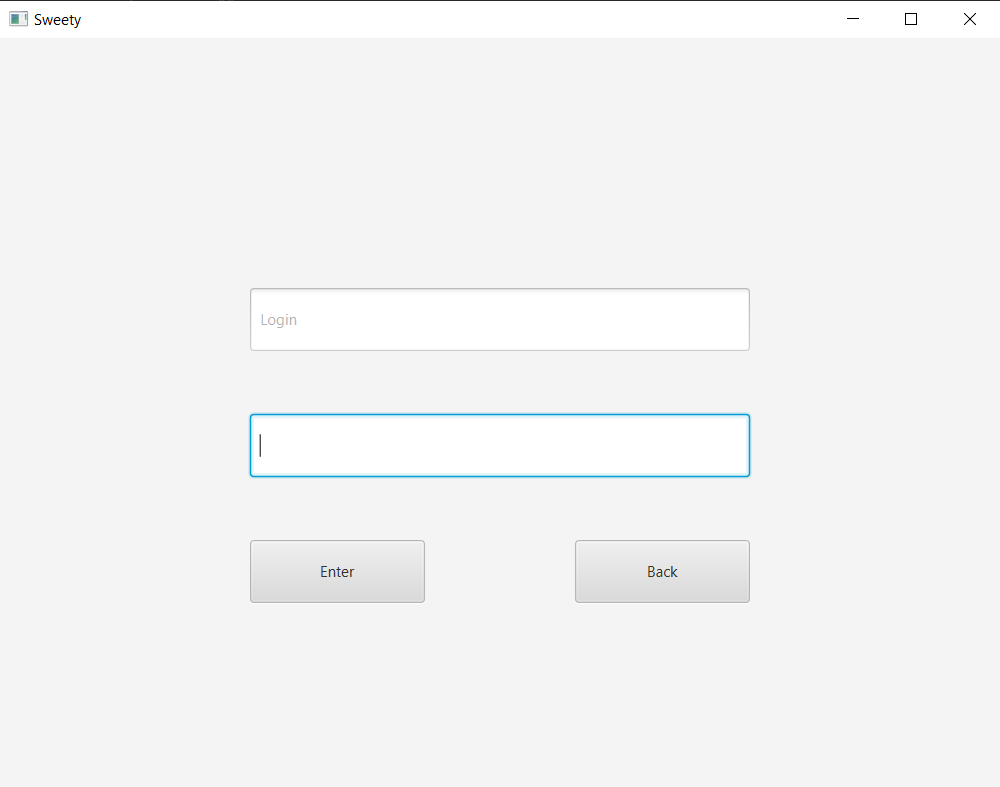
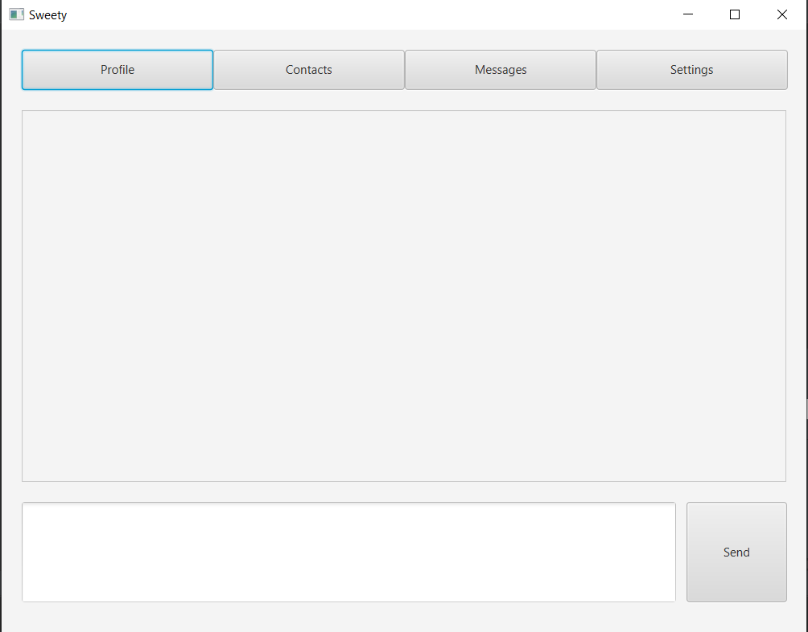

# Представление результатов

| ID | Назначение/название | Сценарий | Ожидаемый результат | Фактический результат | Оценка |
|:---:|:---:|:---|:---|:---|:---|
| 1 | Вход в приложение под Именем | 1. Запустите приложение. 2. На появившемся окне нажмите кнопку "Enter". 3. В поле Login введите свое Имя и нажмите кнопку "Enter" ([рисунок 1](#1)). | Появилось главное окно приложения ([рисунок 2](#2)) с полями для ввода сообщений и их отображения. | Появилось главное окно приложения | Тест пройден. |
| 2 | Регистрация нового пользователя | 1. Выполните сценарий 1.1 2. На появившемся окне нажмите кнопку "Registration". 3. В поле Login и Password введите свое Имя И Пароль и нажмите кнопку "Registration". | Появилось сообщение об удачной регистрации и открылось окно входа в прилодение. | Функционал не реализован. | Тест не пройден. |
| 3 | Отправление сообщения в диалог | 1. Выполните сценарий 1. 2. В главном окне приложения в поле для ввода сообщения наберите текст. 3. Нажмите кнопку "Send".  | В поле для отображения сообщений появилось новое сообщение, отправленное Вами. | В поле для отображения сообщений появилось новое сообщение. | Тест пройден. |
| 4 | Получение сообщения от других пользователей | 1. Выполните сценарий 3 с другого устройства. 2. Выполните сценарий 1 на своем устройстве. 3. | В вашем окне, в поле для сообщений появилось сообщение, отправленное с другого сутройства. | В поле для сообщений появилось сообщение, отправленное с другого сутройства. | Тест пройден. |
| 5 | Доступ к окну настройки профиля | 1. Выполните сценарий 1. 2. Нажмите "Profile". 3. Нажмите "Edit". | Появлось окно настроек профиля пользователя. |Функционал не реализован.  | Тест не пройден. |
| 6 | Добавление нового контакта | 1. Выполните сценарий 1. 2. Нажмите на кнопку "Contacts". 3. Нажмите нопку "Add". 4. В появившемся окне введите в поле "Name" Имя пользователя. 4. Подтвердите ввод строки нажатием на кнопку "Add". | Появление окна с сообщением о том, что контакт добавлен. | Функционал не реализованн. | Тест не пройден. |
|  |  |  |  |  |  |

# Иллюстрации

<a name="1"/>

Рисунок 1.

<a name="2"/>

Рисунок 2.

